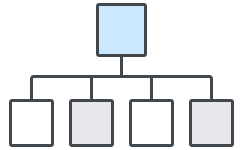

---
---

# Principles <small>디자인 공통 원칙</small>

## H2
##### H5 사용자가 클릭하거나 터치할 때 발생하는 동작에 대한 피드백을 제공합니다. 버튼 내 텍스트 레이블은 사용자가 명확하게 이해할 수 있도록 직관적이고 간결하게 작성합니다. 

### H3
##### H5 사용자가 클릭하거나 터치할 때 발생하는 동작에 대한 피드백을 제공합니다. 버튼 내 텍스트 레이블은 사용자가 명확하게 이해할 수 있도록 직관적이고 간결하게 작성합니다.

#### H4
##### H5 사용자가 클릭하거나 터치할 때 발생하는 동작에 대한 피드백을 제공합니다. 버튼 내 텍스트 레이블은 사용자가 명확하게 이해할 수 있도록 직관적이고 간결하게 작성합니다.

### Bullet
- bullet_1
- bullet_1
  - bullet_2
  - bullet_2
    - bullet_3
    - bullet_3

### 인용문
> 오른쪽 토글 버튼을 눌러보세요.

> 오른쪽 토글 버튼을 눌러보세요.<br>
> 오른쪽 제외를 눌러보세요.

### Table

|구분|사용|
|---|---|
|Price|대여, 할인, 40권/화 미만 무료, 40권/화 이상 무료|
|Adult|성인 도서|
|Set|세트 도서|
|HD|고화질 도서|

### Link
변경하지 않고 그대로 사용해도 좋은 기본 설정을 만듭니다. [사용성 전문가인 자레드 스풀(Jared Spool)의 설문 조사]()에 의하면 95% 이상의 사용자는 기본 설정을 그대로 사용합니다. 다양하고 너무 많은 선택지를 주어 사용자에게 고민을 전가하지 않습니다. 직접 고민하여 내린 최적의 옵션만 제안합니다.

### Code
```html
<ul class="rui_compact_pagination">
  <li class="left_button_wrapper">
    <button type="button" class="compact_button">
      <span class="icon-arrow_8_left">
        <span class="hidden">이전</span>
      </span>
    </button>
  </li>
</ul>
```

### Image


###### H6 리디북스 서점, 리디셀렉트, 페이퍼샵에서 공통으로 사용하는 UI 컴포넌트입니다.
