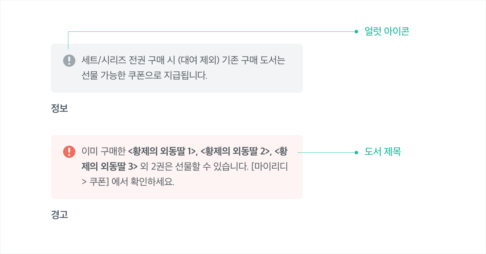
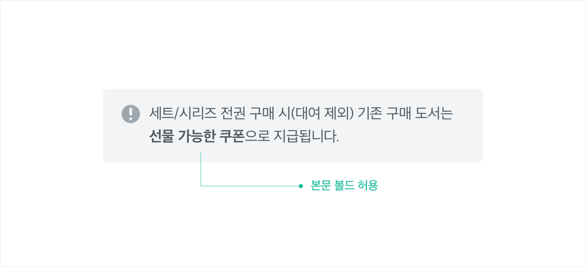
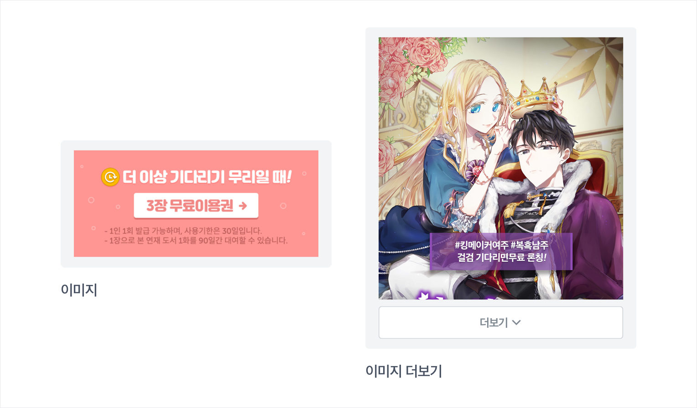

---
---

# Components

리디북스 서점, 리디셀렉트, 페이퍼 샵에서 공통으로 사용하는 UI 컴포넌트입니다.

## Alerts

공지나 안내 사항 같은 부가적인 정보나 경고 상태를 알릴 때 사용합니다.

### 타입

- 정보
    - 사용자에게 행동을 요구하지 않는 정보 전달에 쓰입니다.
- 경고
    - 사용자에게 행동을 요구하거나 꼭 알아야 할 중요한 정보 전달에 쓰입니다.

### 요소에 따른 케이스

#### 텍스트만 있는 경우

- 본문 내 `bold` 효과를 쓸 수 있습니다.

#### 링크 버튼이 있는 경우

- 텍스트 링크에는 `bold`와 `underline` 효과가 적용되고 오른쪽에 `>` 아이콘이 붙습니다.

#### 더보기 버튼이 있는 경우

- 본문이 아래 높이 값을 초과하는 경우 `더보기` 버튼이 붙습니다.
    - 모바일: 160px 이상
    - 데스크톱:  180px 이상
- 펼친 후에 `더보기` 버튼은 사라집니다.

#### 이미지가 있는 경우

- 이미지를 눌렀을 때 외부 링크로 이동할 수 있습니다.
- 이미지가 아래 높이 값을 초과하는 경우 `더보기` 버튼이 붙습니다.
    - 모바일: 320px 이상
    - 데스크톱: 600px 이상
- 펼친 후에 `더보기` 버튼은 사라집니다.

## Book components

리디의 주 콘텐츠인 책의 표지와 책 제목, 저자명 등의 부가 정보를 노출할 때 사용하는 컴포넌트입니다.

### 섬네일

#### 크기 

- 각 책의 아이덴티티를 보여주는, 본래 표지 높이를 사용하기 위해 가로 크기를 기준으로 합니다. 그래서 책마다 높이가 다 다릅니다.
- 표지의 높이가 너무 길면 레이아웃이 흐트러질 수 있습니다. 따라서 아래 계산법에 따라 산출된 최대 높이를 일괄적으로 사용합니다.
  - `max-height: width * 1.618 - 10px`
- 사용 목적에 따라 분류한 섬네일 크기 가이드라인의 사용을 권장합니다. 하지만 서비스 및 기기의 특성, 주변 디자인 요소에 따라 가이드라인을 적용하기 어려운 경우는 예외를 허용합니다.

| 가로 기준 크기(px) | 사용                                                         |
| ------------------ | ------------------------------------------------------------ |
| 40-50              | 작은 영역에서 사용                                           |
| 60-70              | 표시되는 메타데이터가 많거나 액션 버튼이 함께 노출되는 리스트 영역에서 사용 |
| 80-120             | 표지를 강조해야 하는 주요 리스트 영역에서 사용               |
| 150, 200           | 표지를 단독으로 강조할 때 사용                               |

#### 스타일

- 섬네일에 `linear-gradient`와 `border` 효과를 아래와 같이 공통으로 적용합니다. 이는 섬네일을 부드럽게 강조하고 돋보이게 합니다.
  - `background: linear-gradient(to right,rgba(0,0,0,.2) 0,rgba(0,0,0,0)5%,rgba(0,0,0,0) 95%,rgba(0,0,0,.2)100%);`
  - `border: 1px solid rgba(0,0,0,.1);`
- 하지만 서비스 및 기기의 특성, 주변 디자인 요소에 따라 해당 효과를 제외하거나 다른 효과를 추가할 수 있습니다.
  - PAPER 서점에서는 그래픽 요소를 최소화하기 위해 `border`만 적용합니다.
  - 리디셀렉트 상세페이지의 섬네일은 배경색과 구분을 위해 `shadow` 효과를 적용합니다.

#### 배지

| 구분      | 사용                                             |
| --------- | ------------------------------------------------ |
| **Price** | 대여, 할인, 40권/화 미만 무료, 40권/화 이상 무료 |
| **Adult** | 성인 도서                                        |
| **Set**   | 세트 도서                                        |

### 메타 데이터

섬네일, 배지 외에 표시하는 부가 정보입니다. 장르나 책을 제공하는 방식, 판매 방식에 따라 표시되는 정보는 달라집니다.

| 구분                | 사용                |
| ------------------- | ------------------- |
| **Title**           | 도서 제목           |
| **Subtitle**        | 부제목              |
| **Authors**         | 저자                |
| **Translator**      | 역자                |
| **Count**           | 총 권 수, 완결 여부 |
| **Publisher**       | 출판사              |
| **Category**        | 카테고리            |
| **Star rate**       | 별점 및 참여 인원수 |
| **Description**     | 책 소개             |
| **Rental price**    | 대여 가격           |
| **Buy price**       | 구매 가격           |
| **Book type badge** | 만화/소설 배지      |
| **Some deal badge** | 썸딜 배지           |

### 레이아웃 타입

북 컴포넌트는 아래 두 가지 레이아웃을 사용합니다.

#### 세로형

책 표지 - 부가 정보가 세로로 나열된 레이아웃입니다.

- 한눈에 많은 도서를 탐색해야 하는 경우에 사용합니다.
- 섬네일의 높이가 균일하지 않으므로 하단에 맞춰서 정렬합니다.

#### 가로형

책 표지 - 부가 정보가 가로로 나열된 레이아웃입니다.

- 표시할 정보의 양이 많거나 액션 버튼이 함께 노출되어야 하는 경우에 사용합니다.
- 섬네일은 리스트 영역 상단에 배치합니다.

## Buttons

버튼은 한 번의 탭으로 액션을 실행합니다.

### 종류

#### 레이블 버튼

- 기본으로 사용하는 버튼으로, 텍스트 레이블은 한 번에 이해할 수 있게 직관적이고 간결하게 작성합니다.

#### 아이콘 레이블 버튼

- 레이블의 의미가 명확하지 않은 경우, 버튼의 의미를 강조하는 경우에 사용합니다.

#### **아이콘 버튼**

- 아이콘만으로 쉽게 인지가 되어야 하므로 의미를 명확하게 전달할 수 있는 형태를 사용합니다.

#### **텍스트 버튼**

- 텍스트로만 이루어진 버튼으로 사용자를 다른 페이지로 안내하거나 특정 작업을 실행할 수 있도록 돕습니다.
- 텍스트만으로 의미 전달이 어려울 경우에는 아이콘과 함께 사용하기도 합니다.

#### **토글 버튼**

- 두 가지 옵션을 그룹화할 때 사용합니다.

### 컬러에 따른 분류

#### 주요 버튼

- **Dodger blue, Black 필드(filled) 버튼**
  - 페이지 내에서 우선순위가 가장 높은 주요 액션 버튼으로 사용합니다.

#### 보조 버튼

- **White, E-ink Black 아웃라인 버튼**
  - 주요 액션 버튼이 강조되어 있는 페이지 내에서 보조 액션 버튼으로 사용합니다.
  - 화이트 버튼은 배경색이 진할 때 사용합니다.
- **Gray 계열, E-ink Gray 버튼**
  - 페이지 내에서 다른 버튼과 사용이 겹칠 때 기능을 구분하기 위해 사용합니다.  
- **Dodger blue 아웃라인 버튼**
  - 부가 정보 및 기능을 제공할 때 사용합니다.

### 크기

높이 기준으로 지정된 크기를 주변 디자인 요소에 맞게 사용합니다. 버튼의 가로 폭은 양 끝 영역을 패딩으로 지정하여 고정하여 사용할 수 있습니다.

| 버튼 크기(px) |
| ------------- |
| 21            |
| 25            |
| 30            |
| 40            |
| 50            |

### 그룹

기능이 다른 버튼을 같이 배치할 때, 버튼 크기와 사이 간격에 유의합니다. 또한 버튼 그룹에서 주요 버튼을 우측 또는 상단에 위치하도록 레이아웃을 고려해야 합니다.

## Checkboxes

체크박스로 한 개나 그 이상의 아이템을 선택할 수 있습니다.

- 독립적으로 쓰일 때도 있지만 '전체 선택' 같은 상위~하위 체크박스들을 함께 사용할 때도 있습니다.
- 많은 항목을 선택할 때 더 빠르게 많은 항목을 선택할 수 있는 툴팁을 사용하기도 합니다.
- 주로 OS 기본 체크박스를 사용하지만 커스텀 체크박스를 사용할 때도 있습니다.

## Modal dialogs

모달 다이얼로그는 사용자가 특정 행동을 했을 때 추가적인 설명이나 결정이 필요할 때 사용합니다. 

### 종류

#### 확인

- 사용자가 확인해야 할 정보가 있을 때, 안내 사항을 전달할 때 사용합니다. 
  - ex. 소멸 예정 리디포인트 안내, 기다리면 무료 도움말

#### 입력

- 사용자가 직접 입력해야 할 정보가 있는 경우 사용합니다.
  - ex. 회원가입, 로그인, 쿠폰 등록

#### 선택

- 다음 단계로 넘어가기 위해 사용자의 선택이 필요한 경우 사용합니다.
  - ex. 리디셀렉트 > 도서 교체, 웹뷰어 다음 화 보기 > 결제하기

### 구성

모달 다이얼로그의 기본 구성 요소입니다. 상황에 따라 모든 요소가 포함되지 않을 수도 있습니다.

#### 헤드 영역

- 모달의 타이틀은 모달을 띄운 버튼의 레이블과 일치하는 것이 좋습니다.

#### 바디 영역

- **제목**
  - 모달 내에서 사용자에게 전달하고자 하는 내용을 표시합니다. 
- **본문** 
  - 제목만으로 전달이 어려운 경우 본문 텍스트를 추가할 수 있습니다. 내용은 빠르게 파악할 수 있도록 간결하게 작성합니다.
- **액션 버튼**
  - 버튼 내 레이블은 사용자의 다음 행동을 명확하게 안내할 수 있어야 합니다.
  - 제공하는 버튼의 개수가 많아지지 않도록 주의해야 합니다.

### 유의사항

- 화면의 크기가 바뀌어도 화면 중앙에 위치할 수 있도록 하고, 필요한 경우에는 Y축을 고정할 수 있습니다.
- 웹뷰어에서 사용하는 모달 다이얼로그는 테마를 지원합니다.
- 사용자가 즉시 알아야 할 중요한 내용을 간단한 메시지로 전달할 때는 네이티브 모달 다이얼로그를 사용합니다.

## Lists

리스트는 텍스트나 이미지가 수직으로 연속적으로 나열되는 컴포넌트를 일컫습니다. 한 가지 주제의 데이터 유형을 나열할 때 가장 적합합니다.

모든 행을 아우르는 타이틀이 반드시 존재하는 테이블과 달리 리스트는 행마다 주요 텍스트, 부가 텍스트가 각각 표시됩니다. 리스트 행들을 묶어서 서브 헤더를 표시하기도 합니다.

### 종류

#### 구성에 따라서

- 텍스트만 있는 경우
  - 주요 텍스트만 있는 경우
  - 주요 텍스트와 부가 텍스트가 함께 있는 경우
- 이미지, 아이콘을 함께 쓰는 경우
- 체크박스, 라디오 버튼을 함께 쓰는 경우

#### 액션에 따라서

- 주요 액션만 있는 경우
- 주요 액션과 부가적인 액션이 함께 있는 경우
  - 부가 액션은 오른쪽에 배치하여 주요 액션과 확실히 구분되어야 합니다.
  - 부가 액션의 충분한 터치 영역 확보가 중요합니다.

#### 서브 헤더 유무에 따라서

- 서브 헤더 없이 나열되는 경우
- 서브 헤더에 따라 구분되어 나열되는 경우

## Pagination

많은 양의 콘텐츠를 여러 페이지로 나뉘어 있을 때 페이지네이션으로 특정 페이지나 처음, 끝으로 이동할 수 있습니다.

### 동작

#### 처음/끝 버튼

- **> / 끝** 버튼을 눌렀을 경우 다음 페이지네이션 순서의 가장 처음에 위치한 페이지 번호로 이동합니다.
- **< / 처음** 버튼을 눌렀을 경우 이전 페이지네이션 순서의 가장 처음에 위치한 페이지 번호로 이동합니다.

#### URL 리다이렉션

- URL에서 음수나 한글 입력 시 첫 페이지로 이동합니다.
- 존재하지 않는 숫자 입력 시 마지막 페이지로 이동합니다.

### 유의사항

- 하나의 페이지일 때는 노출하지 않습니다.

## Radio buttons

선택지 중 하나를 선택할 때 라디오 버튼을 사용합니다. 체크박스와 달리 라디오 버튼은 중복으로 선택할 수 없습니다.

- 많이 사용하는 항목을 기본으로 선택되게 합니다.

## Select boxes

셀렉트 박스로 선택할 옵션 중 하나를 선택할 수 있습니다.

- 옵션 레이블은 한 줄에 표시되도록 간략하게 작성합니다.
- 많이 사용하는 항목을 기본으로 표시합니다.
- 피커는 주로 네이티브 피커를 사용합니다.
- 모든 옵션이 중요한 경우 셀렉트 박스를 사용하지 않고 탭으로 나열하여 사용합니다.

## Tables

테이블은 정보를 열과 행으로 구분하여 사용자가 쉽게 읽고 이해할 수 있도록 돕습니다. 주로 열의 타이틀만 표시합니다.

### 구성

#### 타이틀 영역

- 테이블 내용에 표시할 주요 정보를 명확하고 간결한 레이블로 설명합니다.

#### 정보 영역

- 상세 정보가 표시됩니다.
- 하나의 행에 모든 정보를 표시하기 어려운 경우, 상세 페이지로 연결하여 더 자세하게 표시할 수 있습니다.
- 각 정보에 대한 상태는 명확하게 구분되어야 합니다.

## Tabs

탭을 사용하면 한정된 공간 안에서 연관된 여러 콘텐츠를 체계적으로 보여줄 수 있습니다. 페이지에서 완전히 벗어나지 않고 쉽게 연관된 콘텐츠를 살펴볼 수 있습니다.

### 분류

#### 탭 개수에 따른 분류

- 1개의 탭
- 2개의 탭
  - 주요 탭과 주요 탭 안에 속한 탭으로 구성됩니다.
  - 주요 탭은 속한 탭과 구분되기 쉽도록 판넬 스타일을 사용합니다.

#### 위치에 따른 분류

- 최상단
  - 페이지 타이틀과 함께 사용됩니다.
- 페이지 중간
  - 페이지 중간에 사용하는 탭으로 탭 위에 항상 구분선이 필요합니다.
    - 페이지 중간 탭이 중요할 경우, 스크롤 시 상단에 고정하여 계속 노출할 수 있습니다.

#### 탭 아이템 가로 길이에 따른 분류

모바일에서 탭 아이템 개수가 고정일 때 사용하며 화면의 가로를 모두 사용합니다. 

- 전체 길이를 탭 아이템 개수로 나눠서 모두 균등한 너비인 탭
- 탭 아이템 내 텍스트 레이블의 비율에 맞춰 불균등한 너비를 사용하는 탭
  - 언제 이 탭을 써야 하나요?
    - 탭 아이템이 4개 이상이고 다섯 글자 이상인 텍스트 레이블이 1-2개 있을 때
    - 위 케이스 외에도 불균형해 보인다면 해당 탭을 사용합니다.

#### 가로 스크롤이 가능한 탭

- 주로 탭 아이템 개수가 유동적인 경우 사용합니다.
- 텍스트 레이블의 너비를 기준으로 탭 아이템 가로 길이를 산정하며 탭 아이템은 일정한 여백을 두고 나열됩니다.
- 데스크톱일 경우 우측에 탭 아이템을 계속 넘겨볼 수 있는 버튼이 추가되어야 합니다.

#### 데스크톱 탭

데스크톱 탭은 모바일에서 화면 가로를 모두 채워 쓰던 탭이더라도 가로 스크롤 가능한 탭처럼 텍스트 레이블의 너비를 기준으로 탭 아이템 가로 길이를 산정하여 일정한 여백을 두고 나열하여 사용합니다.

### 유의사항

- 탭 아이템의 텍스트 레이블은 짧고 간결해야 하며 예측할 수 있도록 설명해야 합니다.
- 탭 아이템 개수는 모바일을 고려하여 5개 이하로 구성합니다.
- 탭 아이템 순서는 최대한 중요한 순서로 나열합니다.

## Text Inputs

### 종류

- 싱글 라인 필드

- 텍스트 에어리어

### 유의사항

- 공간이 부족할 경우 레이블은 플레이스홀더로 대체할 수 있습니다.
- 입력한 텍스트의 유효성을 아이콘, 텍스트 등으로 표시하여 시각적인 피드백을 제공하는 게 좋습니다.

## Toasts

사용자의 액션에는 피드백이 필요합니다. 이때 토스트를 노출하여 액션의 결과를 안내합니다.

### 종류

#### 일반

- 사용자에게 추가 옵션을 제공하거나 일반적인 메시지를 전달합니다.

#### 성공

- 작업이 완료되면 사용자에게 알립니다.

#### 얼럿

- 사용자가 작업을 완료하기 전에 해결해야 하는 문제를 알립니다.

### 유의사항

- 짧은 시간 동안 노출되므로 간결하게 메시지를 작성합니다. 최대 2줄까지 작성할 수 있습니다.
- 사용자의 액션을 취소할 수 있는 버튼이나 추가 옵션을 제공할 수 있습니다.
- 토스트가 사라지기 전에도 닫을 수 있게 항상 닫기 버튼을 제공합니다.
- 모바일에서 하단 고정 영역이 있을 경우 토스트와 해당 영역이 겹치지 않도록 간격을 둡니다.

