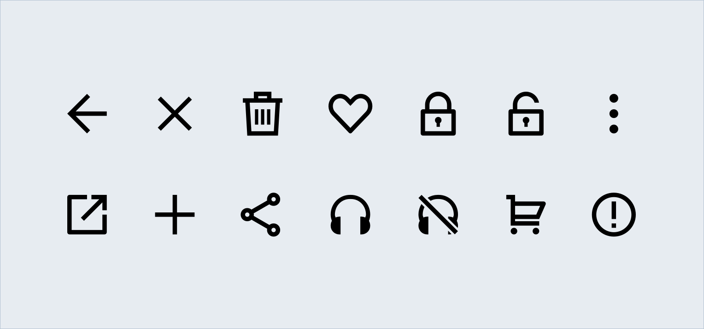
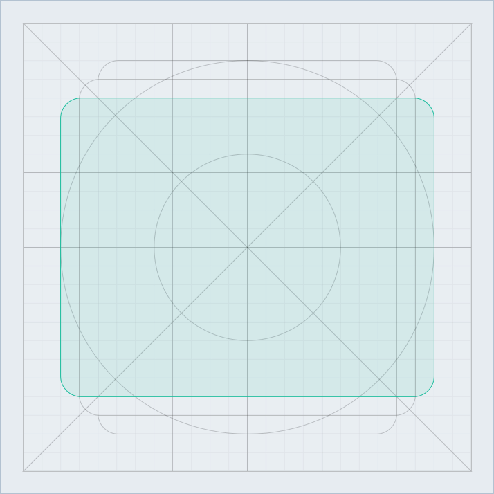
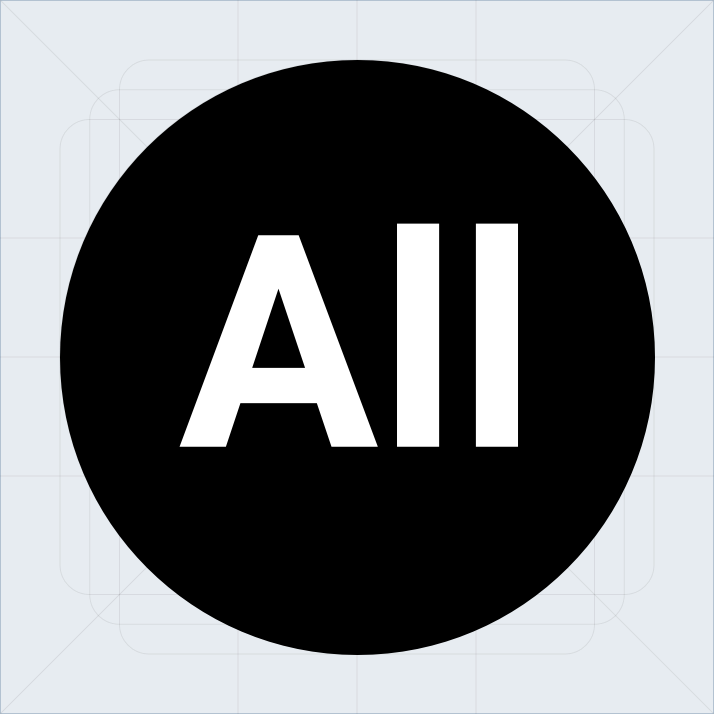

---
---

# Icons 🔥

아이콘은 기능, 행동, 사물의 상징을 최소한으로 표현하여 사용자가 서비스를 이해하는 데 도움을 줍니다. 또한 한정된 공간에서 효율적으로 정보를 전달하는 역할을 합니다. 

## Grid와 Keyline

일정한 사이즈의 그리드와 키라인 내에서 작업하여 디자인 작업과 제품 구현에서 위치와 정렬이 일치하도록 합니다.

 
그리드 - 가로, 세로 24px
{:.columns .firstColumn .caption}

키라인
{:.columns .caption}

### Keyline의 형태

정사각형 - 가로, 세로 18px
{:.columns .firstColumn .caption}

원형 - 지름 20px
{:.columns .caption}

 
세로가 긴 직사각형 - 가로 16px, 세로 20px
{:.columns .firstColumn .caption}

가로가 긴 직사각형 - 가로 20px, 세로 16px
{:.columns .caption}

## 디자인 가이드
### Stroke weight

 
{:.columns .firstColumn}

Stroke weight는 2px이 기준입니다. 
하지만 유연한 디자인 적용을 위해 1px ~ 3px(0.5의 소수점 단위도 허용) 내에서 동일한 스타일로 작업합니다. 
{:.columns .columnText}

### Stroke alignment

 
{:.columns .firstColumn}

Shape의 안쪽으로 Stroke가 생기도록 작업합니다.
이는 아이콘의 형태가 키라인을 지키면서 아이콘을 구성하는 작은 요소들이 균형을 이룰 수 있도록 합니다.
{:.columns .columnText}

### Radius

    <video autoplay loop muted playsinline><source src="system-icon/icon-guide-radius.mp4" type="video/mp4"> 지금 접속하신 브라우저는 비디오를 지원하지 않습니다.</video>

{:.columns .mp4Badge .firstColumn}

모서리가 직각, 예각인 아이콘의 경우 날카로워 보이지 않도록 1px의 라운드 값을 적용합니다.
{:.columns .columnText}

### Cutting

    <video autoplay loop muted playsinline><source src="system-icon/icon-guide-cutting.mp4" type="video/mp4"> 지금 접속하신 브라우저는 비디오를 지원하지 않습니다.</video>

{:.columns .mp4Badge .firstColumn}

아이콘의 일부를 잘라야 할 경우 직각을 기준으로 자릅니다.
{:.columns .columnText}

### Typo

 
{:.columns .firstColumn}

아이콘 내 텍스트 요소는 리디의 제품군과 디자인 스타일에 어울리는 [Roboto](https://fonts.google.com/specimen/Roboto)를 사용합니다.
{:.columns .columnText}

## 아이콘의 이름
이후 구현에 용이하도록 [파스칼 표기법](https://medium.com/better-programming/string-case-styles-camel-pascal-snake-and-kebab-case-981407998841)을 따릅니다.

 
기본적으로 형태의 이름을 따라가고, 형태보다 기능이 명확한 경우 기능의 이름을 적용합니다.
{:.columns .firstColumn}

Filled, Rounded 등의 스타일이나 Disabled와 같이 특정 상황을 표현하는 경우 이름 뒤에 붙입니다.
{:.columns}

같은 형태의 아이콘이 Stroke Weight에 따라 나눠질 경우 폰트 체계(Light, Bold)를 따라 뒤에 붙입니다.  
기준값인 Stroke Weight 2px은 폰트 체계에서 Regular에 속하지만 따로 붙이지 않습니다.

## 아이콘 레이아웃
### 터치, 클릭 영역
터치와 클릭 영역은 너무 작아 인식이 어렵거나 크게 적용하여 영역이 겹쳐 사용자가 의도하지 않은 동작을 하지 않도록 주의합니다. Google의 [Material Design 접근성 가이드](https://material.io/design/usability/accessibility.html#layout-typography)와 [System Icon 가이드](https://material.io/design/iconography/system-icons.html#system-icon-metrics)에서는 아이콘을 단독으로 사용할 경우, 아이콘을 포함한 터치 영역을 48 &times; 48 dp의 터치 영역을 권장하며, 포인터 기반의 기기에서는 40 &times; 40 dp의 영역을 확보하도록 제안하고 있습니다.  
이 크기는 약 9mm의 물리적 크기로 터치 스크린 요소의 권장 크기는 7 ~ 10mm입니다.

### 특정 요소 내 아이콘

    <video autoplay loop muted playsinline><source src="system-icon/icon-layout-icon-in-shape.mp4" type="video/mp4"> 지금 접속하신 브라우저는 비디오를 지원하지 않습니다.</video>

{:.columns .mp4Badge .firstColumn}

중앙 정렬하여 배치합니다. 아이콘을 다양한 각도로 적용하더라도 좌 / 우 / 상 / 하의 여백이 달라지지 않도록 주의합니다.
{:.columns .columnText}

### 텍스트와 함께 사용할 경우

    <video autoplay loop muted playsinline><source src="system-icon/icon-layout-with-text.mp4" type="video/mp4"> 지금 접속하신 브라우저는 비디오를 지원하지 않습니다.</video>

{:.columns .mp4Badge .firstColumn}

간혹 텍스트와 함께 배치할 때 키라인의 기본 여백으로 인해 텍스트와 사이 간격이 넓어져 레이아웃이 어색해질 수 있습니다.  
이 경우, 정확한 레이아웃을 위해 예외로 세로로 긴 직사각형 / 가로로 긴 직사각형의 키라인만을 적용한 아이콘을 사용합니다.  
대체로 레이블 오른쪽에 배치하는 Arrow 아이콘이 이에 해당합니다.
{:.columns .columnText}

