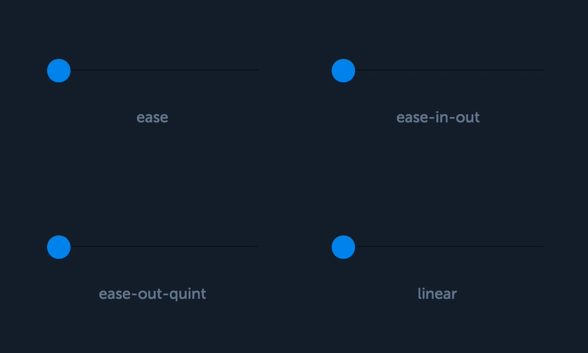
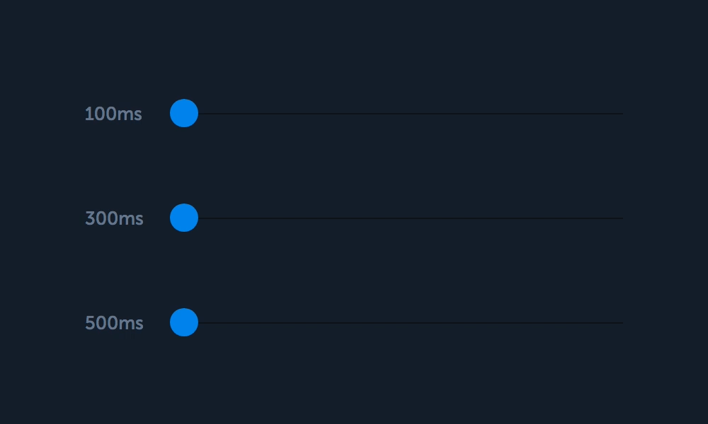
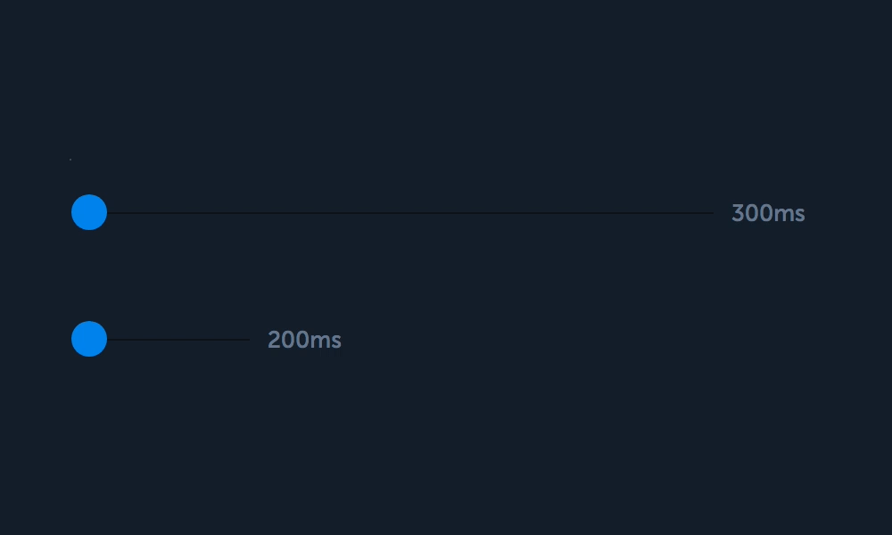

---
---

# Motion

사용자의 인터랙션으로 발생하는 오브젝트의 색깔, 밝기, 크기, 이동 등의 시각적인 변화를 지칭합니다. 모션은 클릭, 터치, 마우스 오버 등 사용자 인터랙션이 일어나는 경우에 적용합니다.

## 모션의 의의

- 사용자 행동에 대한 명확한 피드백을 제공하여 제품을 직관적으로 사용할 수 있도록 돕습니다.
- 요소 간의 상태 변화를 부드럽고 매끄럽게 하여 사용자 인터랙션 경험을 보다 풍부하고 즐겁게 만들어 줍니다.
- 물리적 환경에서 마주치는 움직임을 반영하여 사용자에게 익숙하고 예측 가능한 경험을 제공합니다.
- 일관된 모션은 사용자가 다음 행동을 예상할 수 있게 하고, 최종 목표에 대한 경로를 안내합니다.

## 모션 사용 시 유의사항 

- 기기 및 OS와 오브젝트의 특성을 고려하여 상황에 맞는 모션을 사용하고, 불필요한 모션의 사용으로 사용자의 목표에 방해가 되지 않도록 유의합니다.
- PAPER에서는 기기 특성상 잔상이 남기 때문에 모션의 사용을 지양합니다.

### 이징(easing)

- 이징은 오브젝트의 가속 및 감속을 조절하여 움직임을 자연스럽게 합니다.
- ease-in, ease-in-out은 초기 변화 시 속도가 느리기 때문에 반응이 조금 굼뜬 느낌을 줄 수 있습니다.
- linear는 어색하고 기계적인 느낌을 주므로 사용하지 않습니다.
- 모션의 종류에 따라 easing을 다르게 적용합니다.

 

### 듀레이션(duration)

- 지속 시간이 너무 짧으면 부드러운 전환으로 느껴지지 않습니다. (100ms 이하인 경우)
- 지속 시간이 너무 길면 인터랙션이 원활하지 않다고 느끼게 합니다. (500ms 이상인 경우)
- 상황에 따라 적당한 지속 시간을 정하는 것이 중요합니다.

 

#### 1. 이동 거리

- 오브젝트의 이동 거리가 길수록 지속 시간을 길게 적용합니다.
- 오브젝트의 이동 거리가 짧을수록 지속 시간을 짧게 적용합니다.

 

#### 2. 오브젝트 크기

- 오브젝트의 크기가 클수록 지속 시간을 길게 적용합니다.
- 오브젝트의 크기가 작을수록 지속 시간을 짧게 적용합니다.

## 모션 적용 예시

### 버튼

-  easing
  -  easeOutQuint: cubic-bezier(0.23, 1, 0.32, 1)

-  duration: 200ms

### 팝업

- easing
  - 나올 때: ease-out
  - 들어갈 때: ease-in
- duration: 400ms

### 토스트

- easing
  - 나올 때: ease-out
  - 들어갈 때: ease-in

- duration: 300ms

### 모바일 빅 배너

- easing: easeOutExpo
- duration: 140ms
